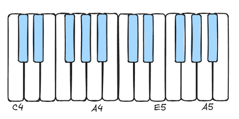
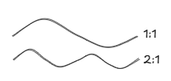
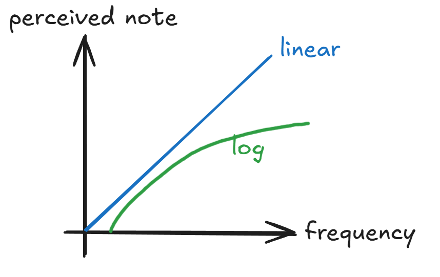
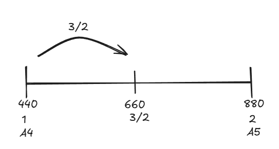
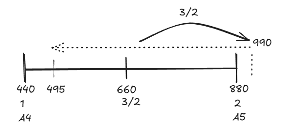

# What is a 'C'? 

When teaching my friend to play piano, he asked me what even is a C note? What's a chord and what's a scale or a key? To me, these had been so ingrained into me that I don't quite think about it actively anymore, and the answer was a bit too longwinded for a piano playing session.

Notes are effectively a **label** for specific frequencies. We also call them 'pitches'. But what makes it complicated is how humans have decided what frequencies gets labelled and strung together, which has to do with what sounds nice, but also some other practicalities.

## Octave

To start, the middle C (C4) on a modern day piano labels a frequency of 261.626Hz. It's called Middle C since there are a total of 8 'C's on the piano spanning from left to right C0 to C8, so, literally in the middle!

Even though people always start with C for the piano since it's all white keys, the alphabet does start with A... and using A will make the numbers easier to follow.

  

A4 is 440Hz, and interestingly, A5 is 880Hz, exactly double. A5 is an octave above A4 (an octave above just means its still A but it sounds noticeably "higher" to our ears). 

If we look at the waveform, it syncs up in a nice 2:1 ratio. Meaning for every period of A4, there are 2 periods of A5. So, we see some kind of relationship between how often the periods sync up, and how our ears perceive them as being harmonious (or 'consonant' we might say). 

The simpler the ratio, the more pleasing to the ear it is. The smaller the ratio numbers are, the simpler the relationship. (e.g. 3:2 vs 89:39 or something)

  

Just to solidify the octave relationship, here are all the 'A's on the piano:
| Note |  Frequency | Ratio  |
| ---- | ---------: | ----------: |
| A0   |   27.50 Hz |         1:1 |
| A1   |   55.00 Hz |         2:1 |
| A2   |  110.00 Hz |         4:1 |
| A3   |  220.00 Hz |         8:1 |
| A4   |  440.00 Hz |        16:1 |
| A5   |  880.00 Hz |        32:1 |
| A6   | 1760.00 Hz |        64:1 |
| A7   | 3520.00 Hz |       128:1 |

## Perfect Intervals
Extending this logic, we can find the next intervals that sound best based on how simple the ratios are.

Since an octave is 2:1, all our ratios in between will have to be <2 to fit within our octave. 

| Interval           |   Ratio | 
| ------------------ | ------: | 
| Octave             |     2:1 | 
| Perfect fifth      |     3:2 | 
| Perfect fourth     |     4:3 |       
| Major third        |     5:4 |        

## Equal Temperament
It might seem counterintuitive to jump ahead, but for the sake of seeing the end before meandering, let's fast forward to what we have today.

With our knowledge of octaves, and a magic number of 12 — we split our octave into 12 equal ratios. We call this **Equal Temperament**. Temperament as in 'tempered' meaning to adjust/tune, not the kind where your piano seems to refuse to cooperate :)

All our notes from A4 to A5 looks like this:
| Semitone | Note    | Ratio                 |  Frequency |
| -----: | ------- | --------------------- | ---------: |
|      1 | A       | 1.000000 (2⁰⁄¹²)  | 440.000 Hz |
|      2 | A♯ / B♭ | 1.059463 (2¹⁄¹²)  | 466.164 Hz |
|      3 | B       | 1.122462 (2²⁄¹²)  | 493.883 Hz |
|      4 | C       | 1.189207 (2³⁄¹²)  | 523.251 Hz |
|      5 | C♯ / D♭ | 1.259921 (2⁴⁄¹²)  | 554.365 Hz |
|      6 | D       | 1.334840 (2⁵⁄¹²)  | 587.330 Hz |
|      7 | D♯ / E♭ | 1.414214 (2⁶⁄¹²)  | 622.254 Hz |
|      8 | E       | 1.498307 (2⁷⁄¹²)  | 659.255 Hz |
|      9 | F       | 1.587401 (2⁸⁄¹²)  | 698.456 Hz |
|     10 | F♯ / G♭ | 1.681793 (2⁹⁄¹²)  | 739.989 Hz |
|     11 | G       | 1.781797 (2¹⁰⁄¹²) | 783.991 Hz |
|     12 | G♯ / A♭ | 1.887749 (2¹¹⁄¹²) | 830.609 Hz |
|     13 | A       | 2.000000 (2¹²⁄¹²) | 880.000 Hz |

> **Side Track for the Math**  
>You might notice.. that's not equal? Well, if you look back at the octave table, where   
>A0 = 27.50,   
>A1 = 55.00,   
>A2 = 110.00    
>
>A2 - A1 = 55Hz  
>A1 - A0 = 27.5Hz   
>They are in fact, half/double of each other.
>
>Turns out frequencies and our ears do not work linearly. Instead, our ears follow a logarithmic curve.    
>  

Anyhow, our A major scale would be:

| Degree | Note  | Ratio                 | Frequency  |
| -----: | ----- | ----------------------| ---------: |
|      1 | A     | 1.000000 (2⁰⁄¹²)  | 440.000 Hz |
|      2 | B     | 1.122462 (2²⁄¹²)  | 493.883 Hz |
|      3 | C♯    | 1.259921 (2⁴⁄¹²)  | 554.365 Hz |
|      4 | D     | 1.334840 (2⁵⁄¹²)  | 587.330 Hz |
|      5 | E     | 1.498307 (2⁷⁄¹²)  | 659.255 Hz |
|      6 | F♯    | 1.681793 (2⁹⁄¹²)  | 739.989 Hz |
|      7 | G♯    | 1.887749 (2¹¹⁄¹²) | 830.609 Hz |
|      8 | A     | 2.000000 (2¹²⁄¹²) | 880.000 Hz |

All great, the end! 

Well... There is a catch.

If you look at the ratios above, and the ratios we previously deemed as harmonious or perfect, then these seem to fall short. I mean, look at all those decimal points? The fifth is 1.498307 of the root. Absolutely irrational. 

So why was this invented?

## Pythagorean Tuning
One of the early scales was built around the concept of the 3:2 ratio sounding good.  

So, if we were to start on A4 again. 

Add 3/2 ratio to the root.  
<!---->
 

The next note would be a ratio of $\left(\frac{3}{2}\right)$ * $\left(\frac{3}{2}\right)$ from the root. That would be $\frac{9}{4}$ ratio.   

However, knowing that our scale is bounded by the octave 2:1 ratio, and $\frac{9}{4}$ is more than 2, it was decided we should wrap it down an octave to fit within the bounds (and the math still does work out). Down an octave is half the frequency, so $\frac{9}{4}$ ratio will become $\frac{9}{8}$.   

In pure numbers, $\frac{3}{2}$ * 660 = 990. Divide by half to wrap down, we get 495, which is indeed $\frac{9}{8}$ of 440.  
<!---->
 

If we keep stacking 3:2 ratio notes in the same fashion, this is the scale we get:
| Degree | Note |   Ratio |  Frequency |
| -----: | ---- | ------: | ---------: |
|      1 | A4    |     1:1 | 440.000 Hz |
|      2 | B4    |     9:8 | 495.000 Hz |
|      3 | C♯5   |   81:64 | 556.875 Hz |
|      4 | D5    |     4:3 | 586.667 Hz |
|      5 | E5    |     3:2 | 660.000 Hz |
|      6 | F♯5   |   27:16 | 742.500 Hz |
|      7 | G♯5   | 243:128 | 835.313 Hz |
|      8 | A5    |     2:1 | 880.000 Hz |

Once we are done with our scale that fits within an octave, we can simply double the frequencies to extend the scale further upwards. 
| Degree | Note |   Ratio |   Frequency |
| -----: | ---- | ------: | ---------: |
|      8 | A5   |     2:1 |  880.000 Hz |
|      9 | B5   |     9:4 |  990.000 Hz |
|     10 | C♯6  |   81:32 | 1113.750 Hz |
|     11 | D6   |     8:3 | 1173.333 Hz |
|     12 | E6   |     3:1 | 1320.000 Hz |
|     13 | F♯6  |    27:8 | 1485.000 Hz |
|     14 | G♯6  |  243:64 | 1670.625 Hz |
|     15 | A6   |     4:1 | 1760.000 Hz |

### Problem: The circle of fifths that doesn't close
We have two paths now to compare / rules to follow  
1: Octaves are 2:1 ratios  
2: Stacking 3:2 ratios  

C → G → D → A → E → B → F♯ → C♯ → G♯ → D♯ → A♯ → F → C

Since we have 12 notes in the scale, if we go round in fifths 12 times, we land back at C, 7 octaves from where we started.

However, the two paths actually lead to a different math for this C.  
Based on path 1: 2⁷ ratio of root = 128   
Based on path 2: $\left(\frac{3}{2}\right)^{12}$ of root = 129.74. 

This gap is referred to as the **Pythagoras Comma**.

Logically speaking, this is an impossibility — one note cannot have 2 possible frequencies. 

The 'resolution' to this, is to still respect the octave ratios, squeezing back 129.74 to 128. And so the 12th fifth we have will be of this ratio, also called the **'Wolf Fifth'**:

$$
\frac{128}{\left(\frac{3}{2}\right)^{11}} = \frac{262144}{177147}
$$

 

> Mathematically speaking, to make this method work, you would need to solve this equation:
>
> $$ {\left(\frac{3}{2}\right)^{x}} = {2^{y}} $$
> 
> This has no whole number solution, and if you wanted to get close, x and y would be quite large — and x represents the number of notes in a scale. As someone who struggles with a 12-tone scale, I think it's quite enough. Practically, the distance between each note will also get smaller and smaller, making it more and more difficult for our ears to differentiate between each note.

Hence, depending on where we reference the start of the chain to be, the Wolf Fifth effectively corrupts one interval in the scale. In the above example, it is F–C. 

But say we start our chain from A  
A → E → B → F♯ → C♯ → G♯ → D♯ → A♯ → F → C → G → D → A  
The wolf interval is now D–A. 

(This is slightly unfamiliar territory as we are used to thinking of notes as being fixed, but there is no real fixed notes in Pythagoras, the root is movable.)

The consequence of this meant that musicians had to be careful to avoid these bad sounding intervals. And it also meant there was a limit to how much they could modulate without hitting these wolf intervals.

## Just Intonation
Pythagoras tuning isn't the only tuning that tried to achieve perfect harmonious ratios. A whole family of tunings called 'Just Intonation' experimented with the different ratios. 

Just intonation is classified by its limits e.g. 3-limit, 5-limit, 7-limit etc... which is actually referring to the highest prime number in the ratios.

Pythagoras tuning is considered 3-limit as it uses 1, 2, 3 in its ratios.

5-limit is the most common just intonation, which attempts to tune it for the 3rds to sound pleasant. (Since, if you noticed, thirds in Pythagoras tuning was not in a perfect 5:4 ratio (1.25), but 1.265625.)

| Degree | Note | Ratio | Frequency |
| -----: | ---- | ----: | --------: |
|      1 | A    |   1:1 |  440.0 Hz |
|      2 | B    |   9:8 |  495.0 Hz |
|      3 | C♯   |   5:4 |  550.0 Hz |
|      4 | D    |   4:3 |  586.7 Hz |
|      5 | E    |   3:2 |  660.0 Hz |
|      6 | F♯   |   5:3 |  733.3 Hz |
|      7 | G♯   |  15:8 |  825.0 Hz |
|      8 | A    |   2:1 |  880.0 Hz |

However, this also suffers from similar problems to Pythagoras tuning. 

## The Compromise
Therefore, the current tuning system we are familiar with these days, is really a compromise — it isn't perfect, but we can modulate keys freely, and label each note consistently. We don't have to retune our instruments depending on what key we want, or find that my 'C' is not your 'C'.

Note that this is the Western tuning system, and there are still other tuning systems used in the world such as in Indian and Indonesian cultures.

This also means, interestingly, that in a string ensemble or wind band, we have control to tweak our intervals slightly, to sound more harmonious. But the minute we throw a piano, or harp into the mix, that flexibility is lost. 

## Magic Number 12? 
We kind of hinted at some practical reasons for the number of notes in a scale:
- A manageable number for our human brains
- Achieve intervals that are as close to the perfect ratios — intervals that matter most.
- Historical continuity

And as mentioned, 12-tone western system isn't the only tuning system out there, but it is a pretty good compromise.

## The End
Hope the math didn't hurt too much.