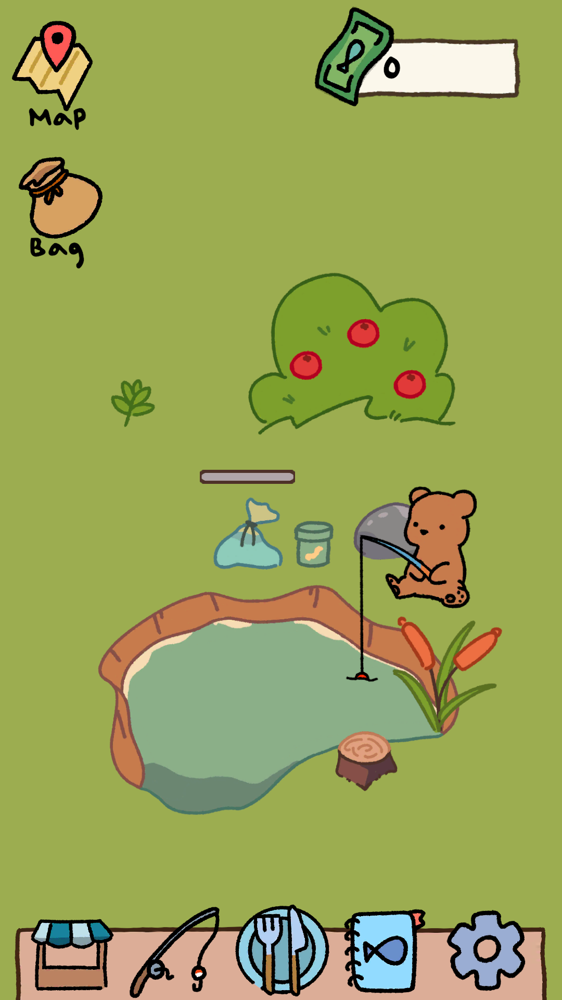
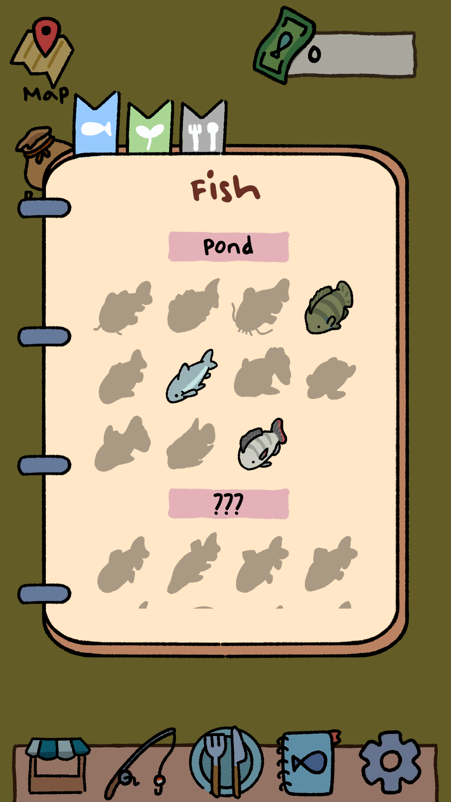

# Released: Pocket Fishing

I released a game on the playstore! Granted, it's really tiny, and some have commented that it is barely a game. And I can see where they are coming from, especially if you aren't familiar with this genre. 

The game is inspired by games like _Neko Atsume_, _Tsuki Odyssey_, and _Animal Crossing_. I call them "idle waiting games", since you don't actually do much actively in the games - you place something, collect something, and you leave the game and come back to see what happens. 

  

<a href="https://play.google.com/store/apps/details?id=com.rollingpandagames.pocketfish" style="display:inline-block; padding:10px 16px; background:#4caf50; color:white; text-decoration:none; border-radius:4px;">Google Play Store</a>

## Goals

But despite its size, its still something. A tiny step. And I'm happy to have perservered through it.

I started working on it sometime in April 2025, but obviously the active periods of working is about half of that. Since I do have a day time life and other life commitments. And honestly, working after your work is not something sustainable for long periods. 

All in all, I did meet what I set out to do.

1. **Proof of completion**

The goal was to make a game with the smallest gameloop, finish it, and publish it. It is kind of a proof of.. not concept, but.. proof that one can complete something. If one could not finish something this small, there is no point thinking about anything bigger. 

Many people start trying to make their dream game (myself included). A rare few succeed, the rest never ever see the light of day, even after years of hard work. The amount of work for a solo developer cannot be underestimated. 

I crochet, and people have come to me saying, "I want to make this big stuff toy!!" I'll say, 'Great! How about you start with a plain flat circle or square?', and they are immediately disappointed. That's boring. But the fact is that your first item is going to look bad. And making a small bad thing is better than spending years making a big bad thing. And as the project stretches, you end up wanting/having to go back and redo the beginning - the code scales badly, you now know better etc. So, making many small things and progressively increasing their complexity/size would be my approach. 

For me, the 'perfect' game to make is 
A. Marketable   
B. Creative  
C. Personally enjoyable    
D. Relieves an interesting technical itch (really, sometimes us programmers just like to do something cool technically).   

Trying to hit achieve all of this and finish it is a huge undertaking. It's not even a triangle of compromises. Even companies with teams of developers struggle to make hit games. So I decided to set these goals aside for now. It is still NOT a clone because I really despise clones, and I don't see the point (as an individual) in making something that already exists, except for pure practice.

It also gives a good time gauge on how long things take when you are working alone. I can handle the code since that's my profession... but then there's design, art, music, testing, admin (I absolutely hate doing admin).

2. **Build more code infrastructure that is reusable for the future**

The first few games are the most difficult partly because you are building every system from scratch. I enjoy expanding my 'engine layer' code so it is less painful the next time - however, in an ever changing landscape, since my code is mostly built on Unity, I wonder how long it would last :')